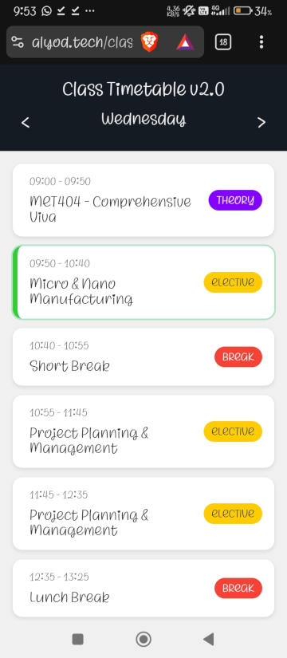

# Class Timetable v2.4

A responsive, Progressive Web App (PWA) for managing and viewing class schedules with real-time period tracking.



## Features

- **Real-time Tracking**: Automatically highlights the current class period
- **Responsive Design**: Works seamlessly on desktop, tablet, and mobile devices
- **Touch Gestures**: Swipe left/right to navigate between days
- **In-App Editor**: Customize your timetable directly in the browser with an intuitive modal editor
- **Local Storage Persistence**: Changes are saved automatically and persist across sessions
- **PWA Support**: Install as a standalone app on mobile devices
- **Offline Capable**: Service worker enables offline functionality
- **Reset to Default**: Restore the original timetable with one click
- **About Modal**: View app information and project links in-app

## Project Structure

```
CLASS-TIMETABLE/
├── build/
├── src/
│   ├── assets/
│   │   ├── apple-touch-icon.png
│   │   ├── calendar.png
│   │   ├── favicon-96x96.png
│   │   ├── favicon.ico
│   │   ├── favicon.svg
│   │   ├── landscape.css
│   │   ├── main.css                      # Main stylesheet
│   │   ├── maskable-icon.png
│   │   ├── portrait.css
│   │   ├── screenshot_1.jpg
│   │   ├── screenshot_2.png
│   │   ├── screenshot_3.png
│   │   ├── screenshot_4.png
│   │   ├── screenshot_360.jpg
│   │   ├── script.js                     # Main application logic
│   │   ├── site.webmanifest              # PWA manifest file
│   │   ├── web-app-manifest-192x192.png
│   │   └── web-app-manifest-512x512.png
│   ├── index.html                        # Main HTML file
│   ├── sw.js                             # Service worker for PWA
│   └── time-table.js                     # Timetable data configuration
├── build.py                              # Build compressed file for hosting to '../build/'
├── LICENSE                               # License file
├── README.md
├── serve.py                              # Local development server with python (if needed)
└── serve.pyw
```

## Getting Started

### Prerequisites

- Python 3.x (if you wanna run the development server)
- A modern web browser with service worker support

### Installation

1. Clone or download this repository:
   ```bash
   git clone https://github.com/amalbenny/class-timetable.git
   cd class-timetable
   ```

2. Run the local development server:
   ```bash
   python3 serve.py
   ```

3. The application will automatically open in your default browser at `http://localhost:1342`

### Alternative Setup

You can also serve the files using any HTTP server of your choice:

```bash
# Using Python's built-in server
python3 -m http.server 8000

# Using Node.js http-server
npx http-server

# Using PHP
php -S localhost:8000
```

## Customizing Your Timetable

You have two ways to customize your timetable:

### Method 1: In-App Editor (Recommended)
Use the built-in editor (pencil button) to modify your schedule directly in the browser. No coding required! Your changes are automatically saved to local storage.

### Method 2: Edit Source Code
For more advanced customization, edit the [time-table.js](time-table.js) file:

```javascript
const timetable = {
  Monday: [
    { 
      start: "09:00", 
      end: "09:50", 
      subject: "Mathematics", 
      type: "theory" 
    },
    // Add more periods...
  ],
  // Add more days...
};
```

### Period Types

The application supports different period types with color-coded badges:

- `theory` - Regular theory classes
- `elective` - Elective courses
- `project` - Project work
- `lab` - Laboratory sessions
- `break` - Break times
- `sp` - Special periods
- `seminar` - Seminar sessions
- `workshop` - Workshop sessions
- `free` - Free periods
- `other` - Other activities

## Usage
Head to https://amalbenny.github.io/class-timetable/ to view a sample timetable hosted in [GitHub Pages](https://pages.github.com/)
### Navigation

- **Desktop**: Use the arrow buttons (◁ ▷) in the header to switch between days or just use arrow keys in keyboard
- **Mobile/Touch**: Swipe left or right to navigate between days
- **Current Period**: The currently active period is automatically highlighted

### In-App Timetable Editor

The app now includes a built-in editor for customizing your timetable without editing code:

1. **Open the Editor**: Click the pencil (✎) button in the header
2. **Select a Day**: Choose the day you want to edit from the dropdown menu
3. **Edit Periods**: 
   - Modify the start/end times of any period
   - Change the subject name
   - Update the period type (Theory, Lab, Elective, Project, Break, etc.)
   - Delete a period by clicking the red "Delete" button
4. **Add New Periods**: Click the "+ Add Period" button to add new classes
5. **Save Changes**: Click "Save Changes" to persist your edits to local storage
6. **Reset to Default**: Click the "Reset to Default" button to restore the original timetable

All changes are automatically saved to your browser's local storage and will persist even after closing the app.

### About Information

Click the info (ℹ) button in the header to view:
- Project description
- Technology stack details
- Links to the GitHub repository and live demo
- Issue reporting and discussion links

### Installing as PWA

**On Mobile (Android/iOS):**
1. Open the app in your browser
2. Tap the browser menu
3. Select "Add to Home Screen" or "Install App"
4. The app will be installed on your device and can be launched like a native app

**On Desktop (Chrome/Edge):**
1. Look for the install icon in the address bar
2. Click it and confirm the installation
3. The app will be available in your applications menu

## Configuration

### Data Storage

Your custom timetable changes are stored in your browser's **localStorage**:
- **Key**: `customTimetable`
- **Location**: Browser's local storage (persists across sessions)
- **Clearing Data**: Use the "Reset to Default" button in the editor to clear custom changes, or clear your browser's storage for the site manually

### Changing the Server Port

Edit [serve.py](serve.py) to change the default port:

```python
PORT = 1342  # Change to your preferred port
```

### Orientation-Specific Styles

To enable different styles for portrait and landscape orientations:

1. Uncomment the orientation-specific stylesheet links in [index.html](index.html)
2. Edit [assets/portrait.css](assets/portrait.css) and [assets/landscape.css](assets/landscape.css) as needed

## Browser Compatibility

- Chrome/Edge: Full support
- Firefox: Full support
- Safari: Full support (iOS 11.3+)
- Opera: Full support

## Development

### File Descriptions

- **index.html**: Main entry point; contains app structure including edit and about modals
- **time-table.js**: Default timetable data configuration
- **assets/script.js**: Core application logic including:
  - Real-time period tracking and rendering
  - Touch gesture navigation (swipe left/right)
  - In-app timetable editor with localStorage persistence
  - Modal management (edit and about modals)
  - Save/reset functionality
- **assets/main.css**: Main styles and theme
- **assets/sw.js**: Service worker for offline caching
- **assets/site.webmanifest**: PWA manifest configuration
- **serve.py**: Simple Python HTTP server with auto-browser launch

### Key Features Implementation

#### LocalStorage Persistence
The app uses browser localStorage to save custom timetable changes:
- Custom timetables are stored under `customTimetable` key
- Changes persist across browser sessions
- Users can reset to default at any time
- Original data in `time-table.js` remains unchanged

#### In-App Editor Modal
The editor modal provides:
- Day selection dropdown
- Dynamic period editor with inline editing
- Delete and add period functionality
- Real-time form updates
- Save and reset buttons

#### About Modal
Displays project information including:
- Feature overview
- Technology stack
- Links to GitHub repository and live demo
- Bug reporting and discussion links

### Adding New Features

The modular structure makes it easy to extend:
- Add new period types by updating: CSS in `main.css` and dropdown in `script.js`
- Modify the layout by editing `index.html` and `main.css`
- Extend editor functionality by modifying the modal markup in `index.html` and logic in `script.js`
- Add custom styles for new period types in the CSS files

## License

See the [LICENSE](LICENSE) file for details.

## Support

For issues or questions, please open an [Issue](https://github.com/amalbenny/class-timetable/issues) or communicate through [Discussions Tab](https://github.com/amalbenny/class-timetable/discussions) in the repository.

---

**Version**: 2.4.9<br/>
**Last Updated**: April 2026

## Recent Updates (v2.4+)

### ✨ Core Features in v2.4+
- **In-App Timetable Editor**: Customize your schedule directly in the browser using the modal editor
- **Local Storage Persistence**: Timetable changes are saved automatically and persist across sessions
- **Reset to Default**: Restore the original timetable with a single click
- **About Modal**: View project information and useful links directly in the app

### 🔧 Improvements
- Enhanced modal UI for better usability
- Automatic period type selection in editor
- Period deletion and addition capabilities
- Improved app information display
